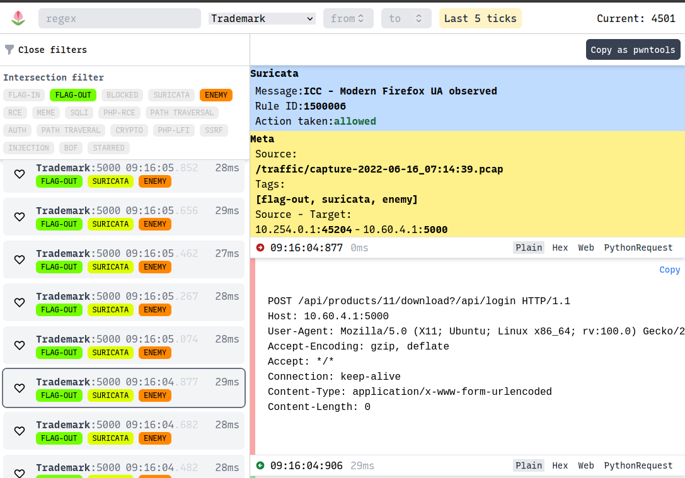

# Tulip

Tulip is a flow analyzer meant for use during Attack / Defence CTF competitions. It allows players to easily find some traffic related to their service, and automatically generates python snippets to replicates attacks.

## Origins
Tulip was developed by Team Europe for use in the first International Cyber Security Challenge. The project is originally a fork of [flower](https://github.com/secgroup/flower), but it contains quite some changes:
* New front-end (typescript / react / tailwind)
* New ingestor code, based on gopacket
* IPv6 support
* Vastly improved filter and tagging system.
* Deep links for easy collaberation
* Added an http decoding pass for compressed data
* Synchronizated with Suricata.

## Screenshots


## Configuration
Before starting the stack, edit `services/configurations.py`:

```
vm_ip = "10.60.4.1"
services = [{"ip": vm_ip, "port": 18080, "name": "BIOMarkt"},
            {"ip": vm_ip, "port": 5555, "name": "SaaS"},
]
```

You can also edit this during the CTF, just rebuild the `api` service:
```
docker-compose up --build -d api
```

## Usage

The stack can be started with docker-compose:
```
docker-compose up -d --build
```
To ingest traffic, it is recommended to create a shared bind mount with the docker-compose. One convenient way to set this up is as follows:
1. On the vulnbox, start a rotating packet sniffer (e.g. tcpdump, suricata, ...)
1. Using rsync, copy complete captures to the machine running tulip (e.g. to /traffic)
1. Add a bind to flower-importer so it can read /traffic

The ingestor will use inotify to watch for new pcap's and suricata logs. No need to set a chron job.


## Suricata synchronization

### Metadata
Tags are read from the metadata field of a rule. For example, here's a simple rule to detect a path traversal:
```
alert tcp any any -> any any (msg: "Path Traversal-../"; flow:to_server; content: "../"; metadata: tag path_traversal; sid:1; rev: 1;)
```
Once this rule is seen in traffic, the `path_traversal` tag will automatically be added to the filters in Tulip.


### eve.json
Suricata alerts are read directly from the `eve.json` file. Because this file can get quite verbose when all extensions are enabled, it is recommended to strip the config down a fair bit. For example:
```yaml
# ...
  - eve-log:
      enabled: yes
      filetype: regular #regular|syslog|unix_dgram|unix_stream|redis
      filename: eve.json
      pcap-file: false
      community-id: false
      community-id-seed: 0
      types:
        - alert:
            metadata: yes
            # Enable the logging of tagged packets for rules using the
            # "tag" keyword.
            tagged-packets: yes
# ...
```

Sessions with matched alerts will be highlighted in the front-end and include which rule was matched.

# Security
Similar to 
